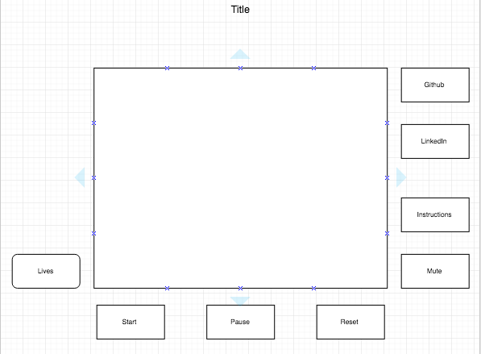

## Frogger

### Background
Frogger is a classic arcade game developed by Konami. It is a 1 player game that plays out on a rectangular grid consisting of 10 rows(11 including starting row). The object of the game is to get the frogger across 9 rows to the other side. The first 4 rows consist of cars moving left or right in varying speeds. There is a 5'th divider row. The last 4 rows before the finish consist of either logs or lily pads. Lily pads can either be "floating" or "submerged". Frogger should follow these rules:

1) The frog may not leave the grid,
2) The frog may not hit a car,
3) The frog may not jump into or be submerged in the water.

### Functionality & MVP

Users will be able to:
- [ ] Start, pause, and reset the game
- [ ] Move the frog around the grid
- [ ] Lose by any of the aforementioned rules
- [ ] Win by getting 5 frogs to the other side of the field

In addition, the project will include:
- [ ] An about modal describing how to play the game
- [ ] A production Readme

### Wireframes
This app will contain a single screen with game board, lives left, and nav links to the Github, my LinkedIn, and instruction modal. Game controls will include start, pause, reset, and mute buttons.

### Architecture and Technologies

This project will be implemented with the following technologies:

- JavaScript for overall structure and game logic
- HTML5 Canvas for DOM manipulation and rendering

'board.js': this script will handle logic for rendering and updating canvas elements

'player.js': will handle all the player logic of the game i.e. dying, winning, moving, etc. A player object will hold the position of the frog as well as number of lives left.

'objects.js': will handle all the moving objects the player can land on or be hit by. It will contain the speed at which the object is moving as well as a boolean value that will dictate whether the player can land on it (lily pad/log) or be hit by it, (car).

### Implementation Timeline

**Day 1**: Learn about canvas and how you will use it with knowledge of javascript. Goals:

-Be able to render a frog, board layout, and/or objects to the Canvas

**Day 2**: Finish reasearch on Canvas and Javascript integration. Start building the board class and basic player movements. Goals:

-Build the board class with a grid
-Be able to move around the frog

**Day 3**: Start building the actual game logic of 'winning' and 'losing'. Goals:

-Be able to move across the board and successfully 'win'
-Be able to move off the grid/or into water and lose a life

**Day 4**: Start building objects class and handle how fast they will move across the board and whether a player may move on top of them. Goals:

-Have logs, lily pads, and cars move across the screen at various speeds
-Be able to land on lily pads, and logs
-Be able to hit cars and lose a life

### Bonus features
- [ ] Point system
- [ ] bonus point pickups
- [ ] multi level with faster objects
- [ ] customizable color schemes
